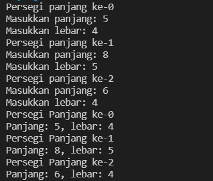
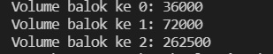
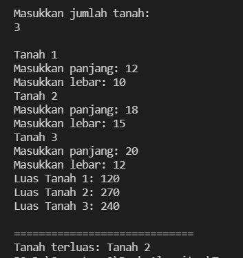
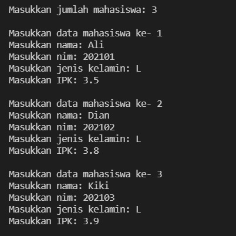
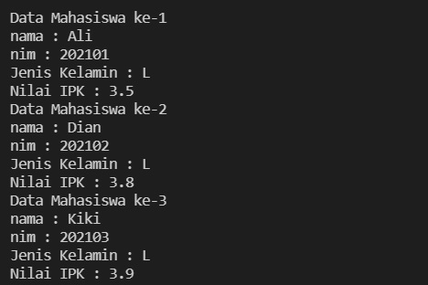

# **Algoritma dan Struktur Data 2021-2022**
**Nama : Andhito Galih Nur Cahyo**

**Kelas : 1F**

**No absen : 06**

**Nim : 2141720138**

**JOBSHEET III ARRAY OF OBJEK** 

**3.2 Membuat Array dari Object, Mengisi dan Menampilkan** 


**3.2.1 Langkah-langkah Percobaan** 
```
public class persegiPanjang {
    public int panjang;
    public int lebar;
}

```

```
class ArrayObjects {
    public static void main(String args[]) {
        persegiPanjang[] ppArray = new persegiPanjang[3];

        ppArray[0] = new persegiPanjang();
        ppArray[0].panjang = 110;
        ppArray[0].lebar = 30;
        
        ppArray[1] = new persegiPanjang();
        ppArray[1].panjang = 80;
        ppArray[1].lebar = 40;
        
        ppArray[2] = new persegiPanjang();
        ppArray[2].panjang = 100;
        ppArray[2].lebar = 20;

        System.out.println("Persegi Panjang ke-0, panjang: "+ppArray[0].panjang+ ", lebar: "+ppArray[0].lebar);
        System.out.println("Persegi Panjang ke-1, panjang: "+ppArray[1].panjang+ ", lebar: "+ppArray[1].lebar);
        System.out.println("Persegi Panjang ke-2, panjang: "+ppArray[2].panjang+ ", lebar: "+ppArray[2].lebar);
    }
}
```

**3.2.2 Verifikasi Hasil Percobaan** 


**3.2.3 Pertanyaan** 
1. Berdasarkan uji coba 3.2, apakah class yang akan dibuat array of object harus selalu memiliki atribut dan sekaligus method?Jelaskan! 

    **Jawab:** 
    
    Tidak, class yang akan dibuat, array of object hanya harus memiliki atribut dan tidak harus memiliki method juga.

2. Apakah  class  PersegiPanjang  memiliki  konstruktor?Jika  tidak,  kenapa  dilakukan  pemanggilan konstruktur pada baris program berikut : 

    **Jawab:**

   Tidak, karena untuk membuat objek persegiPanjang index array ke-1 

3. Apa yang dimaksud dengan kode berikut ini: 

    **Jawab:**

     untuk menginstansiasi objek persegiPanjang dengan nama ppArray berjumlah 3 array

4. Apa yang dimaksud dengan kode berikut ini:

    **Jawab:**

    kode tersebut membuat array indeks ke-1 yang dilakukan input panjang, dan lebar.
5. Mengapa class main dan juga class PersegiPanjang dipisahkan pada uji coba 3.2? 

    **Jawab:**

    agar mudah membedakan antara class main dan class bukan main

**3.3 Menerima Input Isian Array Menggunakan Looping** 

**3.3.1 Langkah-langkah Percobaan** 
```
import java.util.Scanner;
public class PersegiPanjang {
    public int panjang;
    public int lebar;
}

class ArrayObjects {
    public static void main(String[] args) {
        PersegiPanjang[] ppArray = new PersegiPanjang[3];
        Scanner sc = new Scanner(System.in);

        for(int i=0; i<3;i++){
            ppArray[i] = new PersegiPanjang();
            System.out.println("Persegi panjang ke-"+i);
            System.out.print("Masukkan panjang: ");
            ppArray[i].panjang = sc.nextInt();
            System.out.print("Masukkan lebar: ");
            ppArray[i].lebar = sc.nextInt();
        }
       
        for(int i=0; i<3;i++){
            System.out.println("Persegi Panjang ke-"+i);
            System.out.println("Panjang: "+ppArray[i].panjang+", lebar: "+ppArray[i].lebar);
        }
    }
}
```
**3.3.2 Verifikasi Hasil Percobaan** 



**3.3.3 Pertanyaan** 
1. Apakah array of object dapat diimplementasikan pada array 2 Dimensi? 

    **Jawab:**

    bisa
2. Jika jawaban soal no satu iya, berikan contohnya! Jika tidak, jelaskan! 

    **Jawab:**
    Code program:
    ```
    mahasiswa[][] mhs = new mahasiswa [2][2];
    mhs[0][0] = new mahasiswa();

3. Jika diketahui  terdapat class **Persegi** yang memiliki atribut sisi bertipe integer, maka kode dibawah ini akan memunculkan error saat dijalankan. Mengapa?

    **Jawab:**

    Karena belum membuat objek ppArray pada indeks array ke-5, jadi harus ditambahkan sebelum instansiasi objek:

4. Modifikasi kode program pada praktikum 3.3 agar length array menjadi inputan dengan Scanner! 

    **Jawab:**
    ```
    System.out.println("Masukkan batas array : );
    int lengthArray = sc.nextInt();
    PersegiPanjang[] ppArray = new PersegiPanjang[lengthArray];

5. Apakah boleh Jika terjadi duplikasi instansiasi array of objek, misalkan saja instansiasi dilakukan pada **ppArray[i]** sekaligus **ppArray[0]**?Jelaskan !

    **Jawab:**
    Boleh, akan tetapi program tersebut menjadi tidak efisien atau terlalu panjang.

**3.4 Operasi Matematika Atribut Object Array** 

**3.4.1 Langkah-langkah Percobaan** 
```
public class Balok {
    public int panjang;
    public int lebar;
    public int tinggi;

    public Balok(int p, int l, int t){
        panjang = p;
        lebar = l;
        tinggi = t;
    }

    public int hitungVolume(){
        return panjang*lebar*tinggi;
    }
}

class ArrayBalok {
    public static void main(String args[]) {
        Balok[] b1Array = new Balok[3];

        b1Array[0] = new Balok(100,30,12);
        b1Array[1] = new Balok(120,40,15);
        b1Array[2] = new Balok(210,50,25);

        for(int i=0; i<3;i++){
            System.out.println("Volume balok ke "+i+": "+b1Array[i].hitungVolume());
        }
    }
}
```


**3.4.2 Verifikasi Hasil Percobaan** 



**3.4.3 Pertanyaan** 
1. Dapatkah konstruktor berjumlah lebih dalam satu kelas? Jelaskan dengan contoh! 

    **Jawab:**

    Bisa, contohnya:
```
    public class pensil{
    int harga, jumlah;
    public pensil(){

    }
    public buku(int a, int b){
    harga = a;
    jumlah = b;
  }
```

2. Jika diketahui terdapat class **Segitiga** seperti berikut ini: 

```
public class Segitiga {
    public int alas;
    public int tinggi;
} 
```

Tambahkan konstruktor pada class **Segitiga** tersebut yang berisi parameter **int a**, **int t** yang masing-masing digunakan untuk mengisikan atribut alas dan tinggi. 

**Jawab:**
```
public class Segitiga{
    public int alas;
    public int tinggi;
    
    public Segitiga(int x, int y){
        alas = x;
        tinggi = y;
    }
}
```
3. Tambahkan  method **hitungLuas()**  dan **hitungKeliling()**  pada  class **Segitiga** tersebut. 

    **Jawab:**
```
   public class Segitiga{
    public int alas;
    public int tinggi;
    
    public Segitiga(int a, int t){
        alas = a;
        tinggi = t;
    }

    int hitungLuas(){
        int luas = (alas*tinggi)/2;
        return luas;
    }

    double hitungKeliling(){
        double keliling = (((alas*0.5)*(alas*0.5))+(tinggi*tinggi))*2+alas;
        return keliling;
    }
} 
```

4. Pada fungsi **main**, buat array Segitiga **sgArray** yang berisi 4 elemen, isikan masing-masing atributnya sebagai berikut: 

    sgArray ke-0  alas: 10, tinggi: 4 

    sgArray ke-1  alas: 20, tinggi: 10 

    sgArray ke-2  alas: 15, tinggi: 6 

    sgArray ke-3  alas: 25, tinggi: 10 

    **Jawab:**
    ```
    public class segitigaMain{
    public static void main(String[] args){
        Segitiga[] sgArray = new Segitiga[4];
        for(int i = 0 ; i < sgArray.length ; i++){
            sgArray[i] = new Segitiga();
        }
             sgArray[0].alas = 10;
             sgArray[0].tinggi = 4;
             sgArray[1].alas = 20;
             sgArray[1].tinggi = 10;
             sgArray[2].alas = 15;
             sgArray[2].tinggi = 6;
             sgArray[3].alas = 25;
             sgArray[3].tinggi = 10;
    }
}


5. Kemudian menggunakan looping, cetak luas dan keliling dengan cara memanggil method **hitungLuas()** dan **hitungKeliling()**. 

    **Jawab:**

    ```
    public class segitigaMain{
         public static void main(String[] args){
             Segitiga[] sgArray = new Segitiga[4];
             for (int i = 0 ; i < sgArray.length ; i++){
                 sgArray[i] = new Segitiga();
             }
    sgArray[0].alas = 10;
    sgArray[0].tinggi = 4;
    sgArray[1].alas = 20;
    sgArray[1].tinggi = 10;
    sgArray[2].alas = 15;
    sgArray[2].tinggi = 6;
    sgArray[3].alas = 25;
    sgArray[3].tinggi = 10;

    for (int i = 0 ; i < sgArray.length ; i++){
    System.out.println("Luas Segitiga ke - " + (i+1) + " adalah : " + sgArray[i].hitungLuas());
    System.out.println("Keliling Segitiga ke - " + (i+1) + " adalah : " + sgArray[i].hitungKeliling());
        }
    }
}


**3.5 Latihan Praktikum** 
1. Buatlah program yang dapat menghitung luas permukaan dan volume beberapa bangun ruang (minimal 3, jenis bangun luas bebas). Buatlah 3 (tiga) class sesuai dengan jumlah jenis bangun ruang. Dan buat satu main class untuk membuat array of objek yang menginputkan atribut-atribut yang ada menggunakan konstruktor semua bangun ruang tersebut.  Keterangan : Buat looping untuk menginputkan masing-masing atributnya, kemudian tampilkan luas permukaan dan volume dari tiap jenis bangun ruang tersebut.

    **Jawab:**


2. Sebuah perusahaan jual beli tanah membutuhkan sebuah program yang dapat memberitahu luas tanah. Program tersebut dapat menerima input jumlah tanah yang akan dihitung dan atribut panjang dan lebar masing-masing dari tanah yang diinputkan. Program dapat menampilkan luas tanah masing-masing tanah yang diinputkan tadi dan juga tanah terluas dari ketiga tanah yang ada. Contoh output program: 

    **Jawab:**


    

3. Sebuah kampus membutuhkan program untuk menampilkan informasi mahasiswa berupa nama, nim, jenis kelamin dan juga IPK mahasiswa. Program dapat menerima input semua informasi tersebut, kemudian menampilkanya kembali ke user. Implementasikan program tersebut jika dimisalkan terdapat 3 data mahasiswa yang tersedia. Contoh output program: 

    **Jawab:**

    
    

